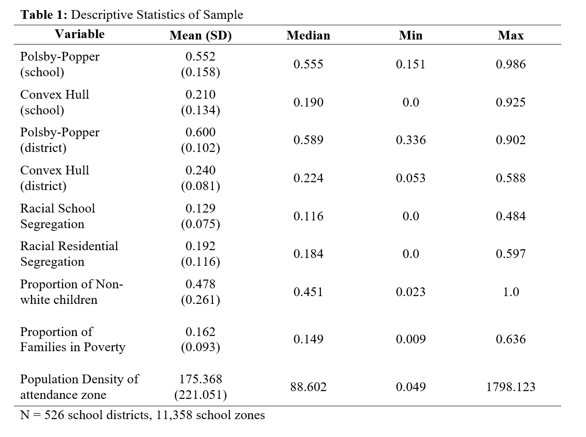
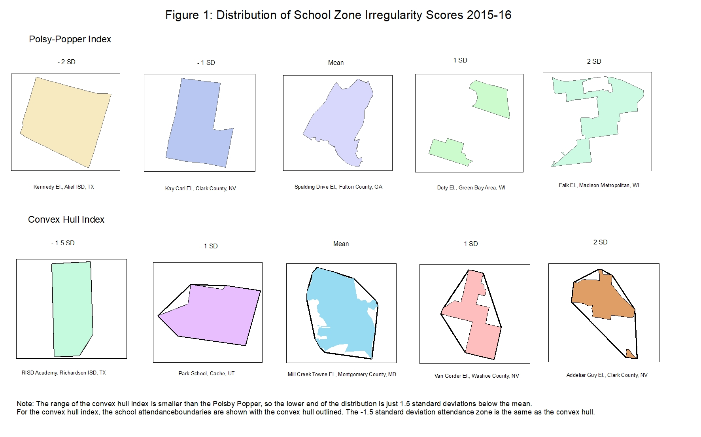
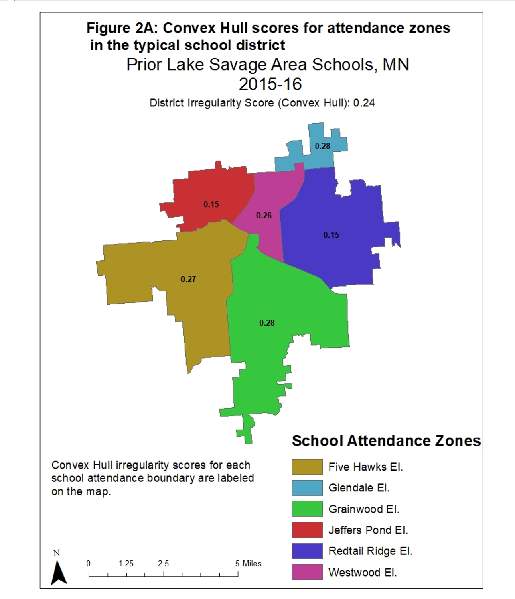
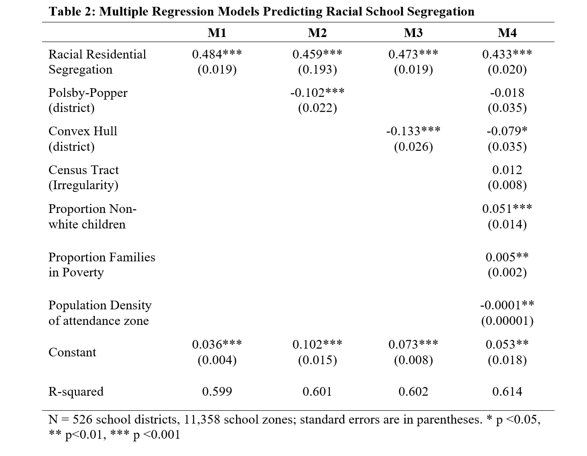
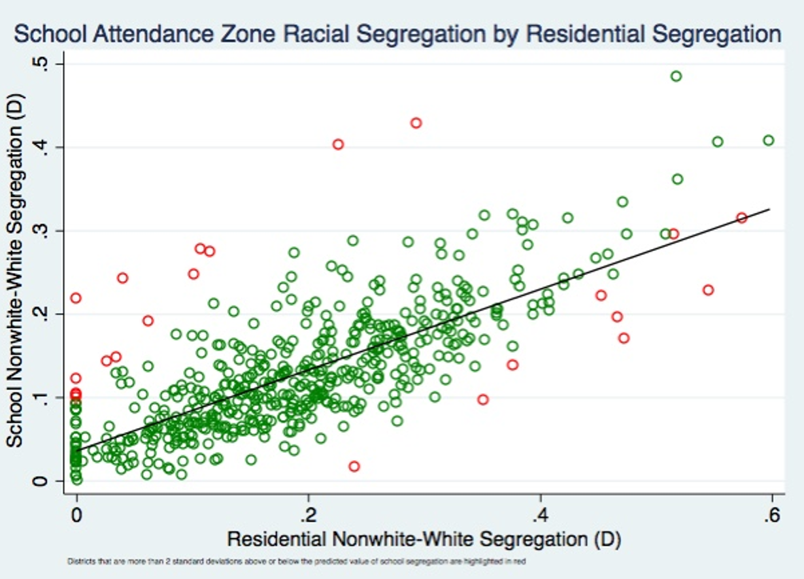
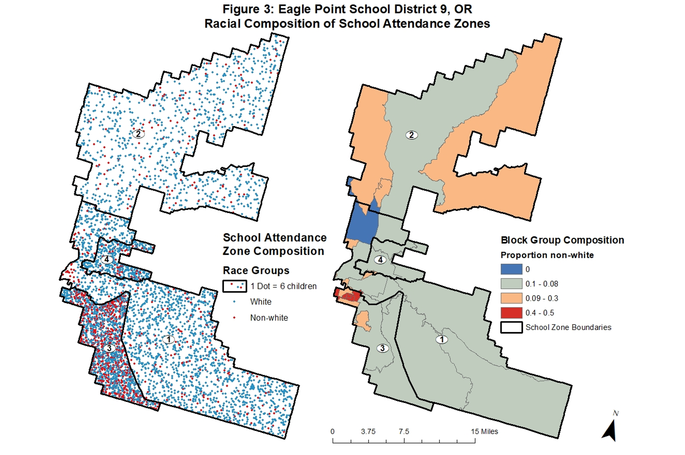
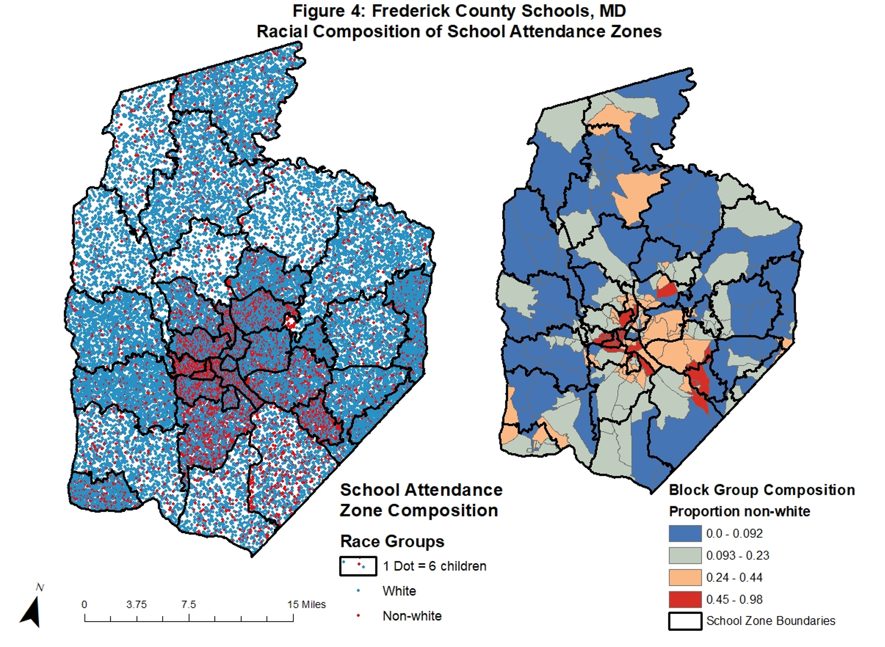
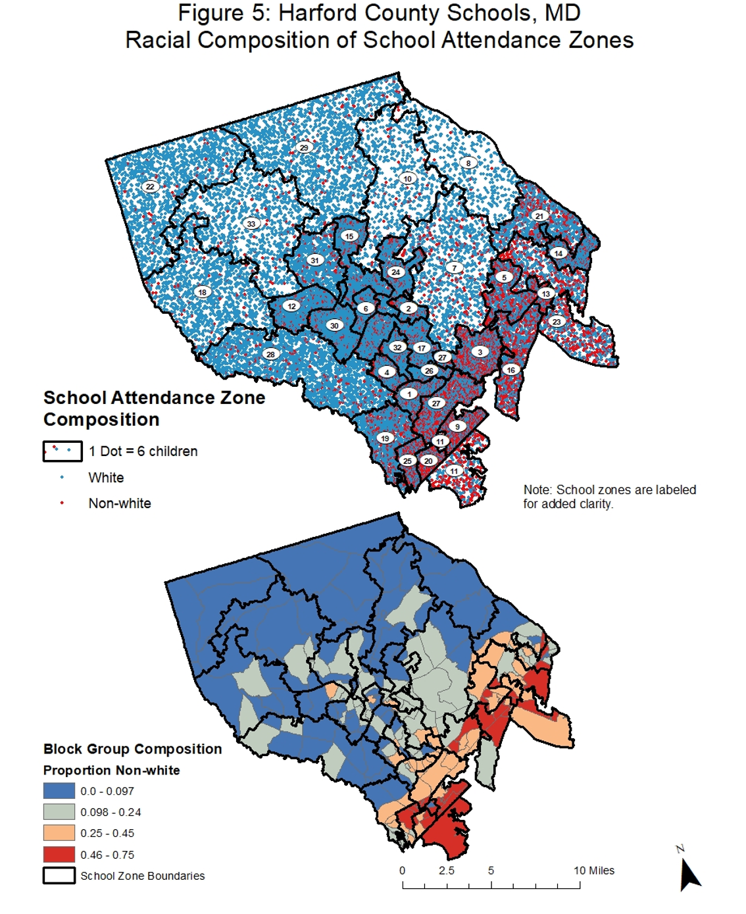

# Introduction
Most school districts in the United States draw maps of school attendance zones, which delineate the residential neighborhoods from which schools will draw their students. As a consequence of relying on students’ residential locations for school assignment, the racial segregation that exists in neighborhoods, cities, and towns typically has been reflected in public schools. However, recent trends in racial residential and school segregation have diverged. Levels of racial segregation in urban schools have been persistent since 2000 (Reardon & Owens, 2014), whereas the levels of residential segregation in cities have been dropping steadily since 1970 (Iceland, 2009). This sets up a puzzle about the role of school boundaries in promoting racial school segregation. Do changes in school attendance zone boundaries drive racial segregation? 
Currently, the empirical and historical evidence on the role boundaries play in segregating students by race is mixed. Some scholars and educators have claimed that persistent levels of school segregation are a consequence of school attendance zone gerrymandering - a practice akin to congressional district gerrymandering where districts draw irregularly shaped attendance zones to draw some neighborhood populations into the school and keep others out (Richards, 2014, 2017; Richards & Stroub, 2015; Clotfelter, 2004; Frankenberg, 2009; Frankenberg & Orfield, 2012; Siegel-Hawley, 2013). Most of these studies make conclusions about the relationship between attendance zone shape and segregation based on a handful of case zones. However, two studies using a national database of first-grade school attendance boundaries complicate the relationship. Richards (2014) compares the racial diversity in the actual zones to the hypothetical zones and finds that the racial diversity in the hypothetical attendance zone is only 0.003 percentage points greater than racial diversity in the actual attendance zones. By contrast, in a follow-up study, Richards and Stroub (2015) find that districts with fewer gerrymandered school zones are more segregated than those with more, which they interpret as being a tactic to “subvert residential integration” (p. 22). 
However, these empirical findings contradict theories of segregation and historical evidence. Theoretically, school districts aiming to racially integrate their schools must create attendance zones that include students from distant neighborhoods that have different racial compositions (Goldring et al., 2006; Gordon, 1994; Mitchell, Batie, and Mitchell, 2010; Tannenbaum, 2013). This logic, known as the “Finger Plan”, is considered legal as exhibited by the cases of Swann v. Mecklenburg and Parents v. Seattle. Besides these historical, Supreme Court cases, empirical evidence supporting this perspective is lacking. 
The possibility of school zones being gerrymandered to segregate students by race is troubling in light of the fact that many negative educational outcomes are associated with segregation. Black and Latino students have lower academic performance than white students when they attend districts with higher levels of segregation (Reardon et al., 2016). The racial gaps in achievement arise because racial segregation leads to racial disparities in exposure to school-level poverty (Reardon, 2015). Therefore, school districts that engage in gerrymandering are putting minority students at a greater disadvantage, which runs counter to the belief that core tenant of American public schooling that schools serve as the great equalizers for students regardless of the social and economic backgrounds. Given the serious potential implications of school attendance zone gerrymandering, I set out in this study to address the following question: Are school attendance boundaries associated with increasing racial segregation across schools, net of the level of racial residential segregation in the school zone? 
To address these question and add to the current debate in the literature, I rely on a recently collected national sample of school attendance zone boundaries from 2015. In the following sections I briefly review the prior literature and layout my hypotheses. After describing the data and methods, I present my empirical exploration of the questions about the relationship between school attendance boundaries and racial segregation. Lastly, I conclude with a discussion about the potential promise and pitfalls of irregularly drawn attendance boundaries for racial integration.  
Dynamics of Segregation in Neighborhoods and Metropolitan Areas & School Segregation
The claim that compact attendance zones create racially homogeneous schools has convincing theoretical underpinnings. Seminal research on segregation has established that cities are racially segregated because their neighborhoods are more racially homogeneous than the cities in which they are embedded (Massey & Denton, 1998). This pattern also replicates at higher geographic levels. Metropolitan areas include places that are generally less diverse than the metropolitan areas in which they are embedded (Lee et al., 2008; Reardon et al., 2008).
	In-line with this trend, the scale of segregation is larger than an elementary school in most cities. A large district like the city of Chicago’s, for example, has a highly concentrated black population in the southern third of the district, while the northern third has a high concentration of white people, and the middle has higher concentrations of other racial groups. In a district like Chicago’s, if zones are drawn in a compact, square-like fashion, this will replicate the racial homogeneity in the residential neighborhoods. This leads to the hypothesis that compact attendance zones that resemble circles, squares, and other similar compact polygons replicates the racial homogeneity in local environments. In fact, in districts with clustering like Chicago, it would be difficult to draw a compact shape for an elementary attendance zone and achieve racial diversity in it. Considering the large scale of racial segregation in large school districts as well as the geographic features like lakes, rivers, highways, and mountains that present physical barriers between racial clusters, it seems necessary for school districts to draw irregularly shaped attendance zones to achieve racial integration. Therefore, I hypothesize that more compact attendance zones will be more racially homogeneous than irregularly shaped zones.
At the same time, suburban communities are experiencing demographic changes that may impact residential and school integration. Examinations of segregation between places in metropolitan areas shows that many areas of suburbia are exhibiting signs of racial and socioeconomic segregation (Frankenberg & Orfield, 2012). The racial makeup of suburban neighborhoods varies greatly from highly diverse to very homogeneous. Some suburban schools are also experiencing these changes. Nearly 20% of suburban schools in the largest 25 metros are experiencing rapid change (Frankenberg, 2021) and almost three quarters of black and Latino students in the suburbs of major urban areas attend schools that are over 50% nonwhite (Frankenberg & Orfield, 2008). In this way, residential and school resegregation in the suburbs may lead districts to adopt zoning practices that segregate students. Given that suburban districts have more land area to work with than urban districts, I hypothesize suburban zones may become more irregular to draw out certain neighborhoods that have higher proportions of racial minorities. However, if racial populations are highly clustered like in cities, then drawing more compact zones would be a potential strategy to ensure more homogeneous and segregated schools.

# Data and Methods
The geographic dataset that provides the data for this analysis comes from the School Attendance Boundary Information System (SABINS) (College of William and Mary and the Minnesota Population Center, 2011). SABINS collected and disseminated thousands of attendance zone boundaries on a national level.   I rely on data from the most recent year that is available: the 2015-16 academic year. As common practice in this literature, I select first grade attendance zones for the analysis because this closely approximate what most people think of as an elementary school attendance zone. I consider the lower grade attendance zone because zones for middle and high school grades tend to be larger and frequently overlap with the school district in which they are located. For the purposes of this analysis, I excluded all districts where the 1st grade attendance zone boundary was identical to the district boundary (i.e. the district had only one elementary school or was open enrollment). The analytic sample contains 11,358 school zones nested in 526 districts. 

**Dependent Variable** 
School racial segregation measures the racial diversity of children enrolled in a given school to the racial diversity of the school district at large. I use the 2015-2016 Common Core of Data school enrollment by race to calculate school racial segregation between non-Hispanic white children and children from Black, Hispanic, Asian, and Other race groups using two different segregation measures – the Dissimilarity Index and the Entropy Index. I first calculate the racial composition of the student body in each school and of the student population in the district. Then, I calculate racial segregation using the Dissimilarity Index (D) and Theil’s multigroup entropy index (H) (See appendix for equations). Values of D range from 0 to 1, where 0 represents complete integration and 1 is complete segregation. Values of D can be interpreted as the proportion of the population in one group that would have to move to another school zone in order to create a uniform distribution of the population. Values of H range from zero to one, where one represents complete segregation which represents the scenario the members of every attendance zone within a district are comprised of a single race. In contrast, values of zero represent complete integration, where racial diversity in each attendance zone is the same. For brevity and ease of interpretation, I present the results using the dissimilarity index, however the results are robust regardless of how segregation is measured.  

**Independent Variables**
One of the two key independent variables in the model is residential racial segregation across school attendance boundaries. I use block group level data from the 2013 - 2017 American Community survey to calculate the racial composition of children under the age of 18 residing in school attendance zones.  To tabulate the counts of children from each racial group living in school attendance zones I perform spatial apportionment using the simple area approach in ArcMap. First, I produce block group-school zone subareas by intersecting the blocks groups and school zones and calculate the area of the subarea. Then, I take the population count multiplied by the area of the subarea and divide by the actual area of the block group. This weighs this sub-area by the population, which I then aggregate up to the school attendance zone to get a count of the population in each racial group within the attendance zone. I also further aggregate to the school district to get counts (and then proportions) of each racial group in the district. I follow the same procedure described above for the school segregation measures to generate residential segregation measures. 
The other key independent variable is the school attendance zone irregularity. Irregularity of a shape is determined by comparing a given shape with some ideal shape that is not considered irregular or bizarre. The statistics enabling these comparisons are called compactness measures (Chambers & Miller, 2010). These measures are expressed as ratios comparing the geometric characteristics of a given shape with the characteristics of some ideal shape. In the literature on congressional gerrymandering, where these measures originated, there is not agreement on one ideal measure, in part because the measures capture different aspects of irregularity. For this reason, I used the multiple measures of irregularity that are in Richards and Stroub’s (2015) paper to measure attendance zone shape: the Polsby-Popper index and the Convex Hull index. For brevity however, I present just two of the measures – one capturing the dimension of indentation and the other capturing dispersion, in the regression analyses.
The Polsby-Popper index compares a given shape with a circle by comparing the area of a given shape with the area of a circle with a circumference that equals the original shape’s perimeter. This measure captures how indented a shape is. The convex hull index (Young, 1988) takes the smallest convex polygon that can be drawn around a shape as the ideal compact shape. The area of the convex hull around the school attendance boundary is compared to the actual area of the school attendance boundary. This measure captures the level of dispersion of a shape. I calculated these measures in ArcMap using the calculate geometry tool (equations for the measures shown in appendix). 

**Control Variables**
The topography of the land can influence the shape of attendance zones. Attendance zones that are adjacent to bodies of water, mountains, highways and parks are more likely to be shaped irregularly.  In other places that are flat and lack bodies of water like the western states, roads form grids and when school zones follow these grids they tend to be more compact. For this reason, I control for the influence of topography by measuring the average irregularity of census tracts within districts using the same measures used for school zone irregularity.  
It is possible that districts with larger attendance zones are less segregated than those with smaller attendance zones, so I also control for density of children per square mile and the area of the attendance zone in square miles (Bischoff, 2008). Additionally, I control for the proportion of children in the district who are non-Hispanic Black, non-Hispanic white, and Asian as well as the number of families in a district that meet the poverty threshold. The school district’s overall racial composition or poverty rate may influence the segregation of attendance zones by race. 

**Analytic Plan**
I perform three related closely analyses. First, I provide a descriptive analysis of the typical shapes of attendance zones. I take the measures of the shapes of attendance zones and examine their statistical distributions. Next, I turn to multiple regression analyses to examine to what extent racial residential segregation predicts racial school segregation, and then how much school attendance zone irregularity contributes to school segregation. Lastly, I identify school districts with much higher or lower levels of school segregation than expected based on the residential segregation in the district by taking the standardized difference of the school and residential segregation levels in each district. I examine the distribution of school attendance zone shape to examine whether the boundaries tend toward irregular or compact. I present maps to visualize the distribution of school attendance zone shapes and to highlight the role of boundaries in districts lower than expected levels of school segregation based on residential segregation (i.e. exceptionally integrated cases). 

# Results 
**Descriptive Statistics of School Zone Irregularity**

Table 1 shows the mean irregularity values for attendance zones in 2015-16. Figure 1, which shows example school attendance boundaries in the sample with different irregularity scores, serves as a visual aid to accompany the numerical summary in the table. There is significant variation in the shapes of attendance zones as the range for the Polsby Popper and Convex Hull measures span from 0.15 to 0.98 and 0 to 0.93, respectively.  The average for the Polsby-Popper falls approximately in the middle of the range for the index, suggesting a middling level of irregularity among school zones, particularity on the dimension of indentation. In contrast, the Convex Hull mean irregularity is closer to zero, suggesting that generally U.S. school zones are relatively compact as opposed to dispersed. Moreover, the average irregularity scores on both of these measures for school zones are considerably lower than the averages for U.S. Congressional Districts, which are 0.78 for the Polsby Popper and 0.37 for the Convex Hull (Richards & Stroub, 2015).

Altogether, the descriptive statistics suggest that attendance zones are, on average, not highly irregular in shape. Nonetheless, some attendance zones are wildly irregular in shape as shown in Figure 1. The zones that have scores that are 1 and 2 standard deviation above the mean have multipart polygons, non-contiguous areas, and multiple indentations making them bizarrely shaped in comparison to the circular and convex polygon ideal shapes that the measures are based upon. 
Also, in Table 1 and in Figures 2A and 2B, I present the average attendance zone irregularity scores for school districts. The figures represent the typical district based on the means for the Polsby Popper and Convex Hull indices. The five school zones in Prior Lake Savage Area Schools, in Figure 2A, are very packed together, however, they are quite indented, which suggests that the zones are more irregular on the indentation dimension.  Similarly, in Figure 2B, which shows the 16 school zones in Conejo Valley Unified School District, CA, the zones are moderately indented, but there is also some dispersion among zones. There are three multipart zones have particularly high irregularity scores, and consequently increase the district’s average irregularity score.  

**Multiple Regression Results**

	Table 2 presents the estimates from the regression analyses. Four separate models are shown as the key independent variables and controls were added sequentially. Model 1 affirms the fact that residential racial segregation is a particularly strong predictor of the level of school segregation by race. Residential racial segregation alone explains over 50% of the variation in school racial segregation. Models 2 and 3 individually test the association between school segregation and irregularity, indentation and dispersion, respectively, net of residential racial segregation. For both measures of school zone irregularity, there is a significant negative association between school segregation and school zone irregularity, net of residential segregation. A one percentage point increase in indented irregularity is associated with a ten-percentage point drop in school segregation holding residential segregation constant and a 13-percentage point decrease for dispersion-irregularity. The addition of the irregularity measures does not add much extra explanatory power. Lastly, in the full model with all controls, racial residential segregation remains highly significant, whereas the magnitude of the irregularity coefficients decreases. The convex hull measure remains weakly significant, however. Among the control variables, the proportion of non-white children, families in poverty and population density of attendance zones have significant associations with racial school segregation. This pattern of results holds for the Entropy index measure of segregation, however, the associations between the key independent variables and school segregation are stronger.  

**Identifying Exceptionally Integrated Districts**

Based on the regression analysis, I identified 15 school districts that had higher levels of school segregation than residential segregation. Generally, these are more compact on Polsby popper than the sample average. Also, these districts have lower than the sample average Convex Hull scores. These tendencies speak to the potential of compact boundaries to exacerbate segregation. Interestingly, these districts are diverse in terms of the type of community in which they are embedded in spanning from urban to suburban and rural, which suggests that drawing more compact boundaries influences the racial segregation levels in a similar manner across different types of communities.  
There were seven districts that had less segregation in the schools than the level of segregation in the residential neighborhoods. Like the districts with higher levels of school segregation than residential segregation, these districts tend to have low or average irregularity scores on both the Polsby Popper and Convex Hull measures. Communities across the urban-rural spectrum are all represented in this group. There are four exceptional that had higher than average irregularity scores on one or both of these measures. I created maps of the school attendance zones and their racial compositions for three of the four districts to illustrate how the irregular shapes help capture more diverse populations.  (The one exceptional case that I did not map is North Bend School district in Oregon because it had just two zones).  All of the districts have very high proportions of non-white students; however, they do manage to draw in white students in roughly equal proportions across all of the zones in the district. 

Figure 3 shows a dot density plot depicting the school zones in Eagle Point School District in Oregon and the racial composition in the zone alongside a choropleth map of the proportion of non-white children in block groups with the school zones overlaid. The four school zones are oddly shaped and number one is amoeba-like with a non-contiguity. There is not a single zone that does not have any non-white students within its boundaries, although zone four has the least non-white students. Still, based on the block group map it is clear that the southern boundary of zone four just barely captures part of a block group that has a slightly higher proportion of non-white students than the other block groups that make up its area. Moreover, while zone 3 clearly has the highest number of non-white students as it contains some of the block groups with the highest proportions of non-white children, zones 1 and 2, cover the largest swaths of land area and happen to capture the moderately non-white populated blocks (i.e. orange colored block groups). 

The map of school zones in Frederick County, MD (Figure 4) are less dispersed than those in Eagle Point, however, most of the 33 zones, especially those in the outer ring of the district are particularly indented. In this suburban district, there is clear residential racial clustering with non-white children being predominantly located in the central core of the district, whereas white children tend to be located in the neighborhoods of the outer ring attendance zones. Integrating schools by race with this pattern of residential segregation is tricky, but the indentations of the zones allows for more integration than would otherwise be achieved by drawing compact zones. Some of these indentations allow for some of the outer ring zones to capture the moderately non-white populated block groups, which cultivates a slightly more diverse school. This is not the case for all of the zones, particularly those on the eastern and western outer edges of the district as well as one tiny zone towards the center of the district that is highly compact and appears to be completely non-white. 

The final maps in Figure 5 of school zones and block group compositions in Harford County, MD shows a more intense clustering pattern of residential racial segregation than that in Frederick County, MD. Non-white students tend to live on the southern end of the county, whereas white students tend to be on the northern and eastern half. Still, the indentations of the zones as well as the multipart zones take advantage of this clustering. The two multipart zones – 11 and 27 take advantage of clusters of white students in another area to add more diversity to the school than if the zone just had one part. Similarly, in the middle region of the district, the indented nature of the zone boundaries helps to catch block groups with moderate levels of non-white populations or multiple block groups with low levels of nonwhite populations. This example is the weakest of the three mapped here, however, I think it speaks to the difficulty that residential segregation poses when it comes to drawing school zones in ways that will capture a diverse population of students. 

# Discussion
I find that drawing irregularly shaped boundaries is not the norm for public school districts. This falls in line with Richards’ and colleagues’ research. That being said, the range of shapes that school zones take is large.  When zones are irregular, they are more likely to be indented than dispersed. Further, the results indicate that there is a moderate to weak, negative correlation between irregularly shaped school zones and school segregation even when residential segregation is considered. This finding runs counter to most prior research on school attendance boundaries. The descriptive evidence provided preliminary evidence of my hypothesis that more bizarre shaped school zones would be associated with less racial homogeneity within a zone. 
The outlier analysis and maps added further nuance to the descriptive findings. Most of the outlier districts had relatively compact school zones, but a few of the districts with lower levels of school segregation than we would expect given the level of residential segregation did have higher than average irregularity scores. The three districts’ attendance zones that I mapped showed how dispersed, multipart, and highly indented zones could counter the tendencies of people of the same race to live closer together than people of different races. These types of irregular school zones seemed to capitalize on neighborhoods or clusters of neighborhoods with moderate to high levels of a race group. Moreover, the large sizes of some of the zones (e.g. Eagle Point District 1 and 2 zones) imply that districts do have to go to greater lengths to try to integrate or balance schools on the basis of race across a district. This pattern held across the urban-rural spectrum suggesting that irregularly drawn school zones can create more racially heterogenous schools across a district regardless of the type of community where the district is embedded. 

# Conclusion
	Contrary to popular belief and existing research, the evidence shown here does not suggest that districts are gerrymandering to create more homogeneous school zones beyond the level of homogeneity created by residential segregation. One key takeaway is that it is important to account for the level of residential segregation that exists within a school zone before attributing influence to the boundaries of school zones. That being said, still very few districts draw boundaries that are particularly irregular, and some with more compact or average shaped school zones have lower levels of segregation than levels residential segregation within the school zone alone would predict, so it is important to be clear that irregularly shaped boundaries can be a way to integrate schools but are not a fool-proof strategy. As evidenced by the era of desegregation following the landmark Brown v. Board of Education case themed schools, open enrollments, and school choice are some options that may diversify and desegregate schools. Drawing irregular boundaries should be thought of as one potential option for desegregating schools. Drawing oddly shaped boundaries may not always be an option for districts given concerns of efficiency like operation costs for transportation and parental pushback to longer trips to school. Nonetheless, I recommend that school district leaders draft several potential sets of boundaries and examine the racial compositions of schools based on those boundaries before making a rezoning decision.
Like all studies, this one is not without limitations as well as opportunities to improve the study going forward. The analysis and maps are not able to prove that these boundaries were drawn intentionally to be irregular. The control for topography, census tract irregularity, is a crude manner of getting at this issue. Higher resolution residential data or topographic data would be an improvement. Additionally, I am only looking at boundaries at one point in time, so there is not a prior standard of how irregular a district’s school zones were delineated to use as a comparison. In the future, I plan to add time varying data on boundary changes and consider how changes in school racial composition may affect boundary changes. Finally, there are many measures of shape irregularity – I used two here that capture different aspects of irregularity, but it is worth considering how robust these results are to alternative measures. Additionally, accounting more specifically for multipart features or amoeba like zone shapes is an important task for future research. Going forward, I will apply PCA to the different measures of irregularity to create one index of irregularity. 
All in all, pursuing this line of research further is important because understanding the dimensions of irregularity and how different shapes contribute to segregation can provide scholars and educational practitioners with information about how gerrymandering zones can be used as an exacerbatory or compensatory force when it comes to school segregation. At this time when neighborhoods, cities, and towns are segregated by race and are not predicted to become more integrated in the near future, rezoning with irregular boundaries may be one manner to promote a more integrated future for American public schools. 

